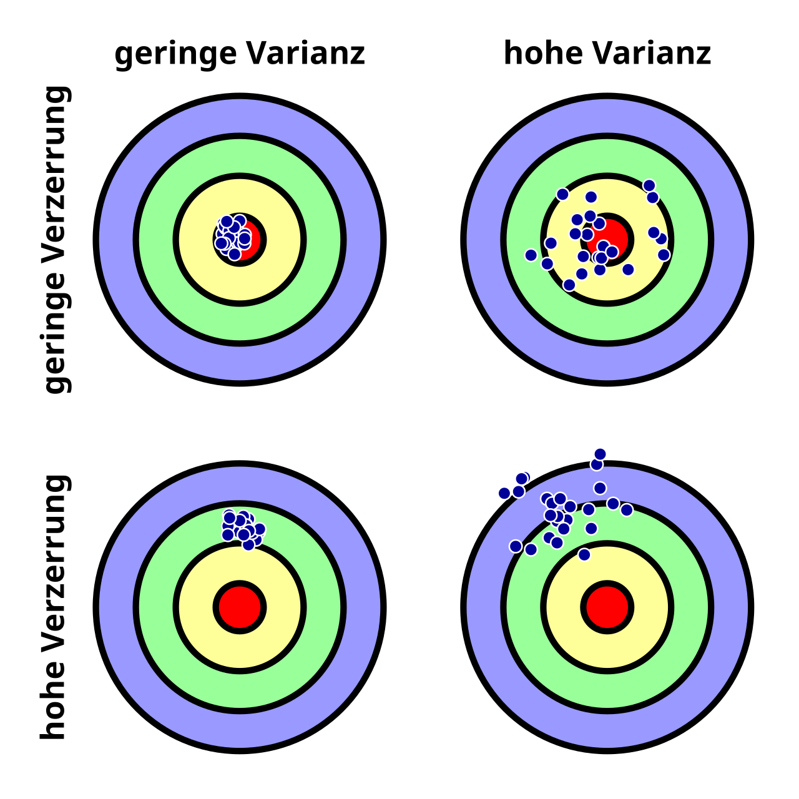

# Bias-Variance Tradeoff

The bias-variance tradeoff is a fundamental concept in machine learning that describes the tradeoff between two sources of error that affect the performance of predictive models. At a point where a more complex model only adds noise, which decreases the train error, but increases test error (overfitting).

## Bias (Verzerrung)

Bias refers to the error introduced by approximating a real-world problem, which may be complex, by a simplified model. High bias can cause an algorithm to miss relevant relations between features and target outputs (underfitting).

### Characteristics of High Bias:
- Oversimplified model
- High error on training data
- High error on test data

## Variance (Varianz)

Variance refers to the error introduced by the model's sensitivity to small fluctuations in the training data. High variance can cause an algorithm to model the random noise in the training data, rather than the intended outputs (overfitting).

### Characteristics of High Variance:
- Complex model
- Low error on training data
- High error on test data

## Tradeoff

The goal is to find a balance between bias and variance to minimize the total error. This involves selecting a model that is complex enough to capture the underlying patterns in the data but not so complex that it overfits the noise.

### Visualization

## Conclusion

Understanding and managing the bias-variance tradeoff is crucial for building effective machine learning models. It requires careful model selection, training, and validation to achieve the best performance on unseen data.
 
